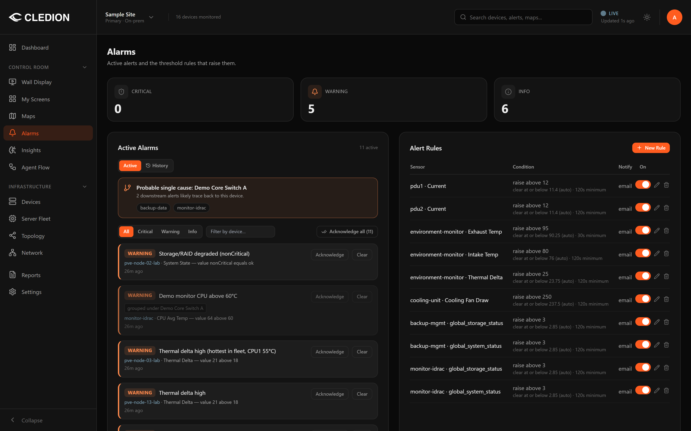
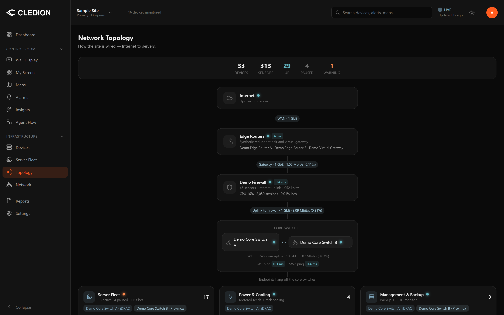
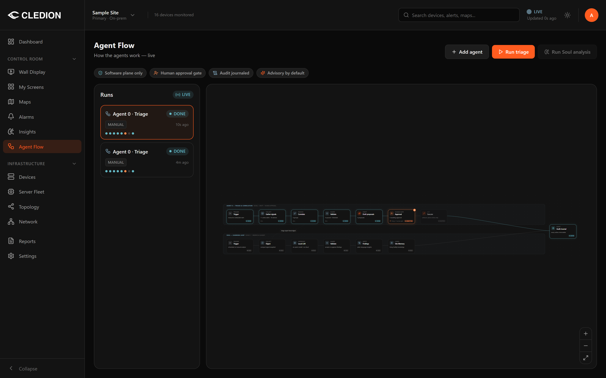
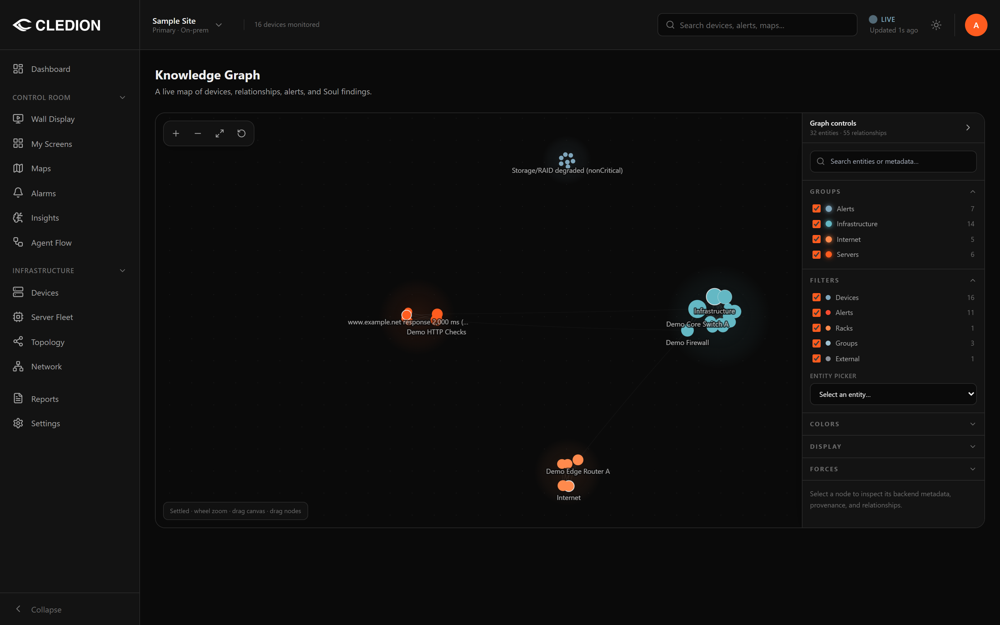

# Cledion Stratum — Downloads

On-prem monitoring for racks, homelabs and small data centres: SNMP polling,
syslog, threshold alerting and topology, running entirely on your own machine.
No cloud account, no outbound connection required.

This repository hosts the download page and the release binaries. The
application source is developed privately — see [Honest notes](#honest-notes).

**Download page:** <https://peterbouharb.github.io/stratum-releases/>

---

## What it looks like

Alerting with hysteresis and root-cause grouping — a raise threshold, a
separate clear threshold, and a minimum breach duration, so a sensor sitting
right on the line does not flap you to death:



Live topology from the upstream link down to the endpoints, with per-hop
latency and link utilisation:



Agent runs are advisory and gated: nothing is executed against your equipment
without a human approving it, and every run is journalled:



A graph of devices, relationships and alerts, for answering "what else depends
on this":



---

## Download — Free v0.2.0

| Platform | File |
| --- | --- |
| Windows installer (recommended) | [Cledion-Stratum-Free-Setup.exe](https://github.com/peterbouharb/stratum-releases/releases/latest/download/Cledion-Stratum-Free-Setup.exe) |
| Windows MSI | [Cledion-Stratum-Free.msi](https://github.com/peterbouharb/stratum-releases/releases/latest/download/Cledion-Stratum-Free.msi) |
| Debian / Ubuntu | [Cledion-Stratum-Free.deb](https://github.com/peterbouharb/stratum-releases/releases/latest/download/Cledion-Stratum-Free.deb) |
| Linux AppImage | [Cledion-Stratum-Free.AppImage](https://github.com/peterbouharb/stratum-releases/releases/latest/download/Cledion-Stratum-Free.AppImage) |
| SHA-256 checksums | [SHA256SUMS.txt](https://github.com/peterbouharb/stratum-releases/releases/latest/download/SHA256SUMS.txt) |

These resolve through `releases/latest`, so they stay correct after every
release rather than going stale. macOS is not published yet.

## Verify your download

```bash
# Linux / macOS
sha256sum -c SHA256SUMS.txt --ignore-missing
```

```powershell
# Windows
Get-FileHash .\Cledion-Stratum-Free-Setup.exe -Algorithm SHA256
```

Compare against the matching line in `SHA256SUMS.txt`. If it does not match,
do not run the installer.

## Honest notes

Worth knowing before you put anything on your network:

- **Closed source.** You cannot audit the code. If that is a blocker for
  infrastructure software — a reasonable position to hold — then
  [LibreNMS](https://github.com/librenms/librenms) or Zabbix will serve you
  better, and that is a fair recommendation rather than a grudging one.
- **Windows installers are signed.** Authenticode signatures are verified in
  CI before upload; the build fails rather than shipping unsigned.
- **The `.deb` is NOT signed.** No Debian package-signing key is configured, so
  `apt` will warn. `SHA256SUMS.txt` shows the bytes are intact — it does not
  prove who built them.
- **SNMP access is read-only.** The poller issues GET and WALK only. It never
  issues an SNMP SET, so it cannot reconfigure your devices.
- **Analytics are opt-in.** Nothing is sent anywhere unless you turn it on.

## Updates

The Free edition checks for updates and asks before installing anything. The
update manifest is `latest.json`, published with each release.

## Installers are release assets

They are not committed to this repository. A previous layout stored them in
`downloads/`, which made a clone of a one-page download site around 246 MB;
they now live only as release assets, which is what that mechanism is for.
